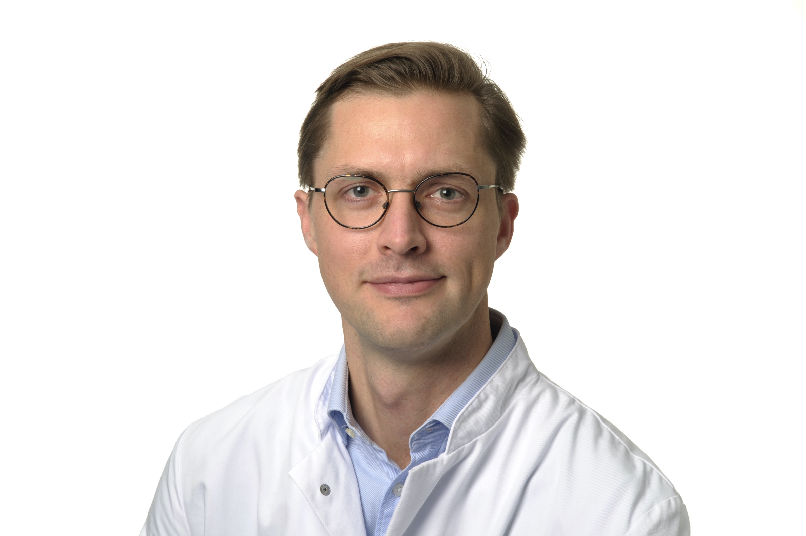

**Johannes C. Hellmuth, MD**  
Physician Scientist and Hematology/Oncology Fellow at the University of Munich  

Experimental Leukemia and Lymphoma Research (ELLF)  
Max-Lebsche Platz 30, 81377 Munich, Germany  

Department of Medicine III (Hematology/Oncology)  
University Hospital, LMU, Munich, Germany  

Twitter  
[@chellmuth](http://twitter.com/jchellmuth)  

Publications  
[Pubmed](https://www.ncbi.nlm.nih.gov/myncbi/1pUmA1takio5y/bibliography/public/)  
[Google Scholar](https://scholar.google.com/citations?hl=de&user=voIBaRUAAAAJ)  

### Research

### Clinical background

