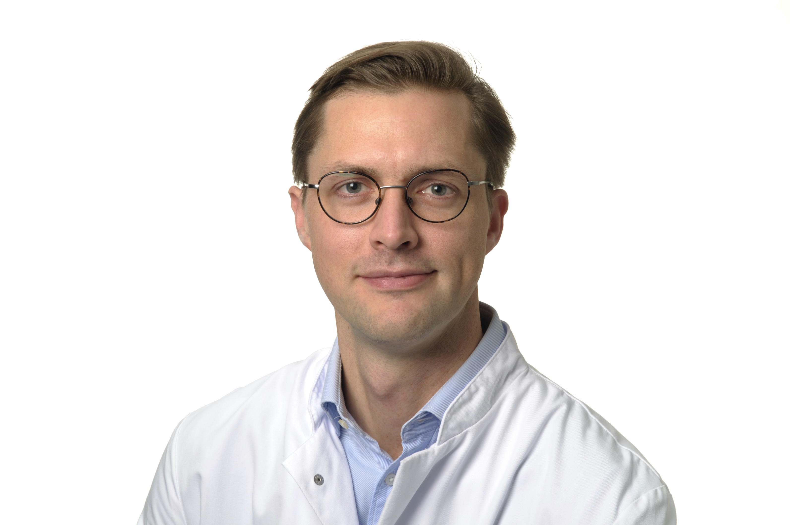

**Johannes C. Hellmuth, MD**  
Physician Scientist in Hematology/Oncology 
at the University of Munich 

Publications 
[NCBI Bibliography](https://www.ncbi.nlm.nih.gov/myncbi/1pUmA1takio5y/bibliography/public/) 
[Google Scholar](https://scholar.google.com/citations?hl=de&user=voIBaRUAAAAJ) 

Twitter 
[@jchellmuth](http://twitter.com/jchellmuth)
 

## Research profile
My main research interest is the key question: how do changes in epigenetic, transcriptional and regulatory networks facilitate malignant transformation and cancer? A better understanding of this fundamental question will be pivotal in building novel and highly personalized treatments as well as developing early detection strategies of malignant and pre-malignant states. 
My research generally focuses on germinal center-derived lymphoma such as diffuse large B-cell lymphoma (DLBCL) and follicular lymphoma (FL). FL and DLBCL are inherently epigenetic diseases as evidenced by the high frequency of mutations in epigenetic modifier genes. They are therefore ideally suited to study how changes in epigenetic and regulatory mechanisms lead to cancer. My work makes extensive use of CRISPR-based methods. Recently, we have used a dual CRISPR screening approach to dissect a large, cell-type defining locus control region that is essential for lymphoma cell survival ([preprint](https://www.ncbi.nlm.nih.gov/pubmed/31723990/)) highlighting the power of CRISPR to interrogate the non-coding genome. My current research focuses on defining non-coding elements that are essential to cancer cell survival and how this knowledge can be leveraged for novel therapeutic strategies.

## Clinical profile
My clinical focus is on the treatment of mlaignant lymphoma. I have served as clinical investigator for multiple clinical trials focusing on Hodgkin Lymphoma. As part of the lymphoma service (head: Prof. Martin Dreylin & Prof. Oliver Weigert) I serve our out-patient lymphoma clinic and lymphoma patients on our general hematology/oncology ward. 

## About this site
Modern cancer research relies on an ever growing arsenal of advanced methods and datasets. Openly sharing these resources enhances reproducibilty, accelerates dissemination of new knowledge and promotes new discoveries - all of which serve the ultimate goal of improving cancer outcomes.
Along these lines, this website aims to make all our resources including code, protocols and data fully available to the research community.
